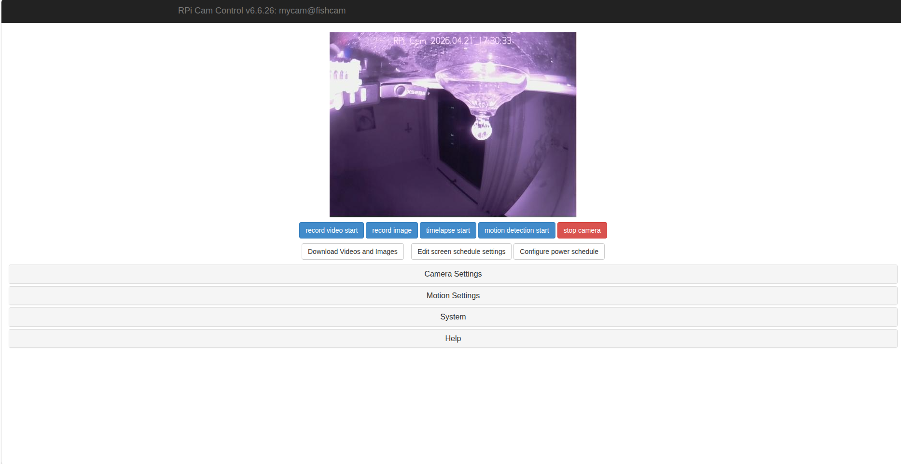
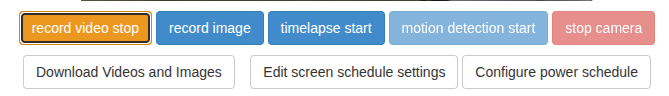
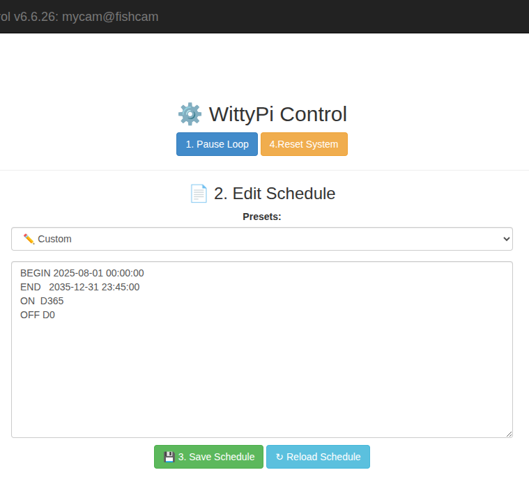
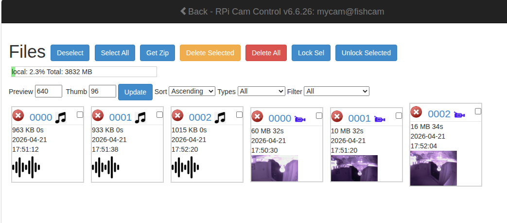

# Fishcam - web-based video and audio record system for fish monitor
Web based interface for controlling the Raspberry Pi Camera, includes motion detection, time lapse, and image and video recording (with separated audio file).

Current version 6.6.26
All information on this project can be found here: http://www.raspberrypi.org/forums/viewtopic.php?f=43&t=63276

The wiki page can be found here:

http://elinux.org/RPi-Cam-Web-Interface

This includes the installation instructions at the top and full technical details.
For latest change details see:

https://github.com/silvanmelchior/RPi_Cam_Web_Interface/commits/master
  

## 🔧 What You Get

- `macros/wittypi_pause_loop`  
  ⛔ Immediately cancels any scheduled shutdown or startup in Witty Pi's memory, stopping the ON/OFF loop **without reboot**.

- `macros/wittypi_reset`  
  🔁 Schedules a safe shutdown now and automatically powers the system back on in **1 minute** using Witty Pi.

- `macros/wittypi_read_schedule`   
  Reads the current system schedule `wittypi/schedule.wpi`.

- `macros/start_vid`   
  Init audio record after video recording start. 

- `macros/end_vid`   
Stop audio record. 

- `macros/end_box`   
Converts video to .mp4. 
---

## 📥 Installation

Run the following commands on your Raspberry Pi to create and install the scripts:

```bash
./install_and_config.sh
```

Warning: use bash to run .sh files (install, remove, update...), not sh. 

## Usage

### External storage 
To improve storage space, use a external drive formated as `FAT32` and named `fishcam`- the system will automatic identify after connection and config the new storage. 

To change or connect a new storage, please reboot the system. 


### System access

To access the system, power on the device and wait a few minutes. 

After that, connect in the same Wifi, and enter the url [http://192.168.15.25/html/](http://192.168.15.25/html/).

The preview page will appear.

<div align="center">
  
</div>

When the system is recording a video, the button `record video start` changes to `record video stop` and changes color.

<div align="center">
  
</div>

---

#### Power configuration - WittyPi

By clicking on the `Configure power schedule` button, the power configuration page opens. Here it is possible to configure how the system will behave in time. 

Important: After POWER-UP a new video recording starts. Before POWER-DOWN a the video recording stops. 

<div align="center">
  
</div>

Following the steps:
1. Click on `Pause loop` button.
2. Choose the desired schedule on the presets list or write a custom made (see [WittyPi generator](https://www.uugear.com/app/wittypi-scriptgen/)).
3. Save the schedule.
4. Reboot the system and wait to reset the recording flux.

INFO: The maximum video duration should be 30 min (video_split default = 1800s), because system limits. So, bigger recording time will split the video.

---
#### Download data

There are two ways to extract the data.

1. By on the `Download videos and images` button:

<div align="center">
  
</div>

    Audio, video and image files can be visualized in this page. By selecting the desired files (use filter or click `Select all`) to download, then click `Download selected` button. A .zip file will be downloaded.  

2. By removing the Pendrive from the system:

Allert: Only use this backup mode with system powered off.


---

© 2026 – Tested and validaded with Witty Pi 4 Mini and Raspberry Pi OS Buster and Raspberry Zero W board. 
